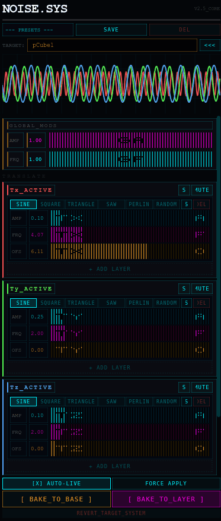

# NOISE.SYS // Jitter Matrix for Maya

<a href="https://github.com/akamrt/NOISE.SYS/raw/main/assets/demo.gif"></a>

### A non-destructive, multi-layered procedural noise generator for Autodesk Maya

---

> *"Stop keyframing camera shake by hand."*

**NOISE.SYS** is a powerful procedural animation tool wrapped in a custom, high-performance terminal UI. Add complex, organic jitter, vibration, and camera shake to any object in Maya instantly — without touching your base animation.

---

## ✨ Features

### 🖥️ Marathon-Inspired Terminal UI
Custom dark terminal interface with a live 60fps oscilloscope waveform visualizer. Stays on top and responds instantly as you tweak parameters.

### 🛡️ Non-Destructive by Design
Works on **referenced rigs**. Your original keyframes are never touched. Noise is routed through a `plusMinusAverage` node network and added on top.

### 🎛️ Multi-Layer Noise Stacking
Stack multiple noise layers on a single axis:
- **SINE** — Smooth oscillation
- **SQUARE** — Hard on/off pulses
- **TRIANGLE** — Linear rise and fall
- **SAW** — Ramp-up waves
- **PERLIN** — Organic continuous noise
- **RANDOM** — Chaotic jitter

### ⚡ Auto-Live Preview
See the noise affect your object in the viewport **in real-time** as you drag any slider. No clicking "apply".

### 💾 Preset System
Save favourite camera shakes and mechanical vibrations to local JSON preferences. Load across scenes instantly.

### 🍰 AnimLayer Baking
One-click baking commits your noise to an **additive Maya Animation Layer** — keeping your base timeline clean.

---

## 📦 Compatibility

| Maya Version | Support |
|-------------|---------|
| Maya 2022 | ✅ |
| Maya 2023 | ✅ |
| Maya 2024 | ✅ PySide2 + PySide6 |
| Maya 2025 | ✅ |

---

## 🚀 Installation

**No complex setup required.**

1. Download `noise_sys_terminal.py`
2. Open Maya → **Script Editor** (`Windows → General Editors → Script Editor`)
3. Switch to the **Python** tab
4. Open the script, select all, **Middle-Mouse-Drag** to your Maya Shelf
5. Click your new shelf button to launch!

---

## 🎮 Usage

1. **Select** the object or camera you want to affect
2. The UI automatically detects your **TARGET**
3. **Unmute** the channels you want to affect (e.g. `Tx`, `Ty`, `Rz` for camera shake)
4. Click **+LAY** to add noise layers
5. Choose noise **Type** and adjust **Amp** / **Freq**
6. Enable **[X] AUTO-LIVE** for real-time viewport preview
7. Click **[BAKE TO LAYER]** when happy

---

## 🎛️ UI Overview

| Element | Function |
|---------|----------|
| **OSCILLOSCOPE** | Live waveform showing all active noise layers |
| **GLOBAL_MODS** | Master amplitude and frequency multiplier |
| **Tx / Ty / Tz** | Translate X/Y/Z noise channels |
| **Rx / Ry / Rz** | Rotate X/Y/Z noise channels |
| **+LAY** | Add a new noise layer to a channel |
| **[BAKE TO BASE]** | Commit noise directly to keyframes |
| **[BAKE TO LAYER]** | Commit noise to an additive Animation Layer |
| **[ REVERT_TARGET_SYSTEM ]** | Remove all noise, restore original animation |

---

## 📂 File Structure

```
NOISE.SYS/
├── noise_sys_terminal.py    # Main script
├── README.md                # This file
├── LICENSE                  # MIT License
└── assets/
    ├── demo.gif             # Real demo (here's what you're getting)
    ├── hero.png             # Hero thumbnail
    └── banner.png           # X/Twitter banner
```

---

## 🤝 Contributing

Issues and pull requests welcome.

---

## 📜 License

MIT License — free to use, modify, and distribute.

---

*NOISE.SYS is not affiliated with Autodesk or Bungie. Marathon is a trademark of Bungie.*
